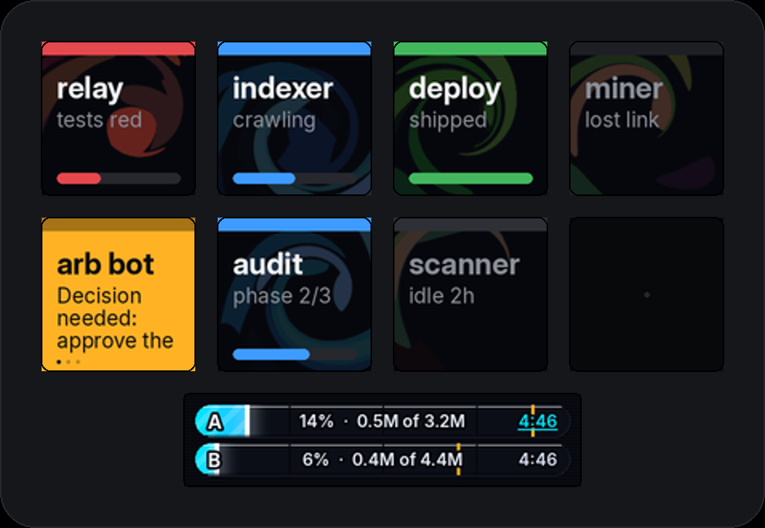

# tallydeck

**Tally lights for your agent fleet.** A Stream Deck becomes the attention
surface for every AI coding session you run: keys flash when something
genuinely needs you, stay calm while agents work, and one press drops you
into the exact session that's asking — briefed, focused, ready to type.



---

## Reading the deck

### The lights: orange vs red

| Light | State | Meaning | What to do |
|---|---|---|---|
| 🟠 **Orange, flashing** | `attention` | The session finished its turn or asked you a question — **your move.** Flashes for 5 minutes, then holds steady orange (still your move, done shouting). | Press it |
| 🔴 **Red, double-pulse** | `blocked` | A hard stop: permission request, failed gate, something that cannot proceed without you. Raised the instant it happens. | Press it now |
| 🔵 **Blue** | `working` | Agent busy — running tools, thinking, writing. Needs nothing. | Enjoy |
| 🟢 **Green** | `success` | Finished well; expires off the deck on its own. | Nothing |
| ⚫ **Gray / dark** | `idle` / `offline` | Alive but quiet, or gone stale. | Nothing |

Hot attention keys show **the actual question**, wrapped across the key —
long asks alternate between two pages of text (watch the little dots), so
you often know your answer before you press.

### The line above each tile (the tally bar)

That top strip is the session's **state in miniature** — same color code as
above:

- **Orange bar** → this session is waiting on you (the whole key will also
  be flashing if it's fresh, steady orange if you've let it sit).
- **Gray bar** → idle session: alive, nothing happening, listed so you know
  it exists.
- **Blue bar** → working.
- **Flashing** always means *fresh* — the state just became yours to act on.

### Everything else on a key

- **Background warmth** — the marbled background's heat (near-black → indigo
  → violet → ember) is that session's **token burn relative to the hottest
  session visible**. Ember = the current #1 spender. Cold black = coasting.
- **`2m · 45k/m`** — quiet-time and burn rate (log-bytes/minute).
- **`A` / `B` badge** — which account's quota the session is draining.
- **Placement** — urgent first, then the busiest, flowing top-left ↓ then
  next column. Keys are **sticky**: a session keeps its key while visible,
  so nothing moves between your glance and your press.

### The bottom strip (Neo info bar)

One lane per account: fill = how much of this 5-hour window is spent
(matches the engraved %), the **amber notch** = your burn target, molten
past the notch. The countdown at the lane's end is when the window resets —
cyan + underlined marks the account **burning right now**.

### The two touch points

- **Left = urgency beacon.** Pulses red/amber when anything (any page)
  needs you; faint blue when all is calm work. **Press it to service the
  most urgent key** without hunting.
- **Right = burn gauge** (cool → hot → molten), or the **page cycler** when
  there are more sessions than keys.

## Pressing a key

Your terminal comes forward and a floating popup appears **over** your tmux
view (nothing underneath moves), showing the brief: where the session left
off, repo state, related queue tasks. Then one key routes it:

| Key | Action |
|---|---|
| **⏎ Enter** | Open the session **floating in the popup** (resumes it first if it isn't running). Work in it; `Ctrl-b d` puts it back. |
| **t** | Open it as a **tab** (window) of your current tmux session |
| **s** | **Split** it into your current window, side by side |
| **␣ space** | **Done** — mute the alert like archiving mail; it revives only if the session asks anew |
| anything else | Dismiss — nothing anywhere changed |
| **long-press the deck key** | Snooze that alarm 15 min (long-press again to wake) |

An alarm **never clears from a press you couldn't see** — it clears when
the session actually receives your answer, or when you explicitly dismiss.

## Raising your own flags

Any script or agent can claim a key — one line, no dependencies:

```bash
tally raise deploy --state blocked --label "prod deploy" --sublabel "gate 3 needs sign-off"
tally clear deploy
```

Agents in this fleet are instructed to raise decision-grade flags
themselves, with the question on the key — and to keep FYIs off the deck.

## Install

**Server (where your agents run):** clone, then expose the hub:

```bash
printf '#!/usr/bin/env bash\nexport PYTHONPATH="$HOME/projects/tallydeck"\nexec /usr/bin/python3 -m tallydeck.cli "${1:-serve}" "${@:2}"\n' > ~/.local/bin/tallyd && chmod +x ~/.local/bin/tallyd
```

**Mac (where the deck is plugged in):** Python 3.11+ required —
`brew install python@3.13 hidapi`, then:

```bash
python3.13 -m venv .venv && source .venv/bin/activate
pip install -e ".[deck]"
ln -sf "$PWD/contrib/tally-open-mac.sh" ~/bin/tally-open-mac.sh
tally deck --demo          # first light (quit the Elgato app first)
tally deck                 # the real fleet, via [client] connect in config
```

### Config, in two layers

`config/tallydeck.toml` is tracked, so shared settings arrive with a `git
pull`. Anything machine-specific — real paths, extra account roots, a task
hook, your timezone — goes in `~/.config/tallydeck/config.toml`, which is
not in the repo and wins over the tracked layer. Keep hosts and secrets out
of the tracked file: see `examples/config.example.toml` for the shape.

The hub is reached by an **ssh alias**, never an address, so nothing
host-specific lives in the repo. Name it whatever you like in the Mac's
`~/.ssh/config` (the default the scripts expect is `claw`), then point
`[client] connect` at that alias — or export `TALLY_SSH_HOST` to override
it for `contrib/tally-open-mac.sh`. `ControlMaster` makes presses instant:

```
Host claw
  HostName your-server.example.com
  User you
  ControlMaster auto
  ControlPath ~/.ssh/cm-%r@%h:%p
  ControlPersist 10m
```

Grant the macOS **Automation** prompt on first press, and **Accessibility**
for your terminal app (System Settings) so presses focus the exact window.

## How it works (the short version)

`Signal` (one unit of attention) → **sources** (Claude session scanner,
watch-directory, token-burn API, Claude Code hooks) → **hub** (merges,
streams NDJSON over stdio — canonically behind `ssh`) → **view** (rank,
sticky slots, pages) → **surfaces** (Stream Deck, terminal, PNG). Presses
travel by signal-id only; nothing arriving over the wire is executed.
Details: [docs/DESIGN.md](docs/DESIGN.md).

## Development

```bash
pip install -e ".[dev]" && pytest
tally --demo png -o /tmp/deck.png    # pixel-true preview, no hardware
```

## Prior art & credits

Bitfocus Companion (feedback/action split, epoch-aligned blink),
[AgentDeck](https://github.com/puritysb/AgentDeck), agentsd, muxplex-deck,
streamdeck-cmux, home-assistant-streamdeck-yaml, and
[python-elgato-streamdeck](https://github.com/abcminiuser/python-elgato-streamdeck)
under the hardware surface. Marbling math: Lu et al., *Mathematical
Marbling*, IEEE CG&A 2012. Type: [Inter](https://rsms.me/inter/) (OFL).
Named for broadcast tally lights: one lamp, one glance, no reading.

[MIT](LICENSE).
