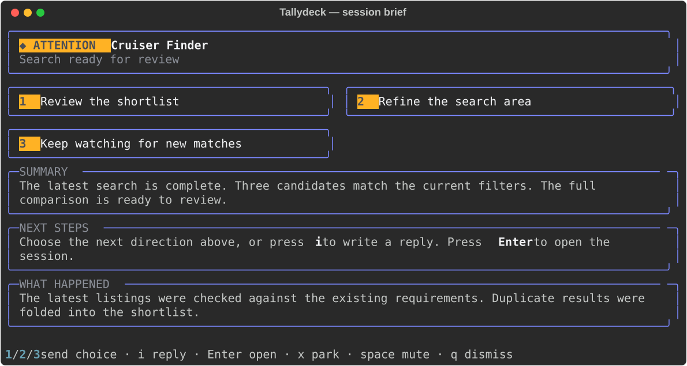

# Operator flow polish

The deck should make three things clear: what needs attention, what happened,
and what the operator can do next. This pass improves the existing product
without adding dependencies or another service.

## Preview

These examples use synthetic content and the same renderers as the device
and terminal popup. They are render checks, not a claim of hardware testing.



The generator also writes normal and flood key frames to
`docs/review/operator-keys.png`. Raster previews remain local generated
artifacts under the repository's existing ignore rules.

## Resulting behavior

- **Readable keys:** title, question and footer have separate space. Long
  tokens wrap within the key; badges, progress and Grok's bottom bar remain
  readable. Two-line titles use a compact question layout. Page indicators
  occupy at most four positions, so long questions cannot overrun the badge.
- **Actionable briefs:** explicit next-step lists become numbered cards. The
  selected card and the text sent to the session come from the same snapshot.
  Historical numbered reports never become commands. Native question tools
  remain answerable in their session UI.
- **Predictable input:** only available numbers act; scrolling and resizing
  preserve the full brief. Bracketed paste cannot accidentally select an
  action. Replies are pasted literally as one block. Delivery failures are
  reported instead of claiming a successful send. A missing pane requires
  resuming before sending, rather than typing into a starting shell.
- **Grok parity:** completed turns, new prompts and thought events have
  distinct states. Quiet live sessions remain visible without claiming to be
  working. Space mutes the current alert using the full session ID; new
  activity rearms it. Attention becomes steady after the configured flash
  period. Children still fold into their parent.
- **Recoverable parking:** verify the live transcript and completed turn,
  reject shared sessions and active children, persist resume information,
  then recheck immediately before signalling the owned process. A process
  that has not exited stays visible. Parking never kills the tmux session.
  Resumed transcript activity automatically restores the key across harnesses.

## Validation

The complete suite covers classification, routing, exclusive decisions,
real terminal input/scroll/resize, and scratch tmux sessions with inert
executables. Additional regression checks cover exact choice payloads,
failed delivery, pasted menu keys, long labels/tokens, footer isolation at
72 and 96 pixels, and parking ownership/activity checks. No real agent is
stopped by the tests.

Release verification: **348 tests passed, plus 8 subtests; no skips**.
The shell router also passes `bash -n`. A read-only scan of the existing
Grok source confirmed unique tile IDs and X badges without dispatching actions.

The standard command is `python -m pytest -q`. The Python environment must
contain the project's existing test dependencies plus Rich for popup checks.
Use an existing environment with both; do not treat skipped popup tests as
validation of the interactive flow.

To recreate the previews from the repository root:

```sh
PYTHONPATH=. python docs/review/generate.py docs/review
```

## Release and device check

This work is staged on `polish/deck-operator-flow`. Before deploying, compare
the current production revision with the branch base and incorporate any
intervening changes. The hub watches its source tree, so merging into its
checkout is a live deployment. Back up any installed copy of `tally-route`,
then update it from `contrib/tally-route` with the Python code.

The drawing changes also require the Mac client's checkout to be updated
and its existing deck process relaunched. A server-only update cannot change
the key images rendered by the client. Reuse the existing connection; do not
start an additional stdio hub.

On the real deck, verify:

1. A Grok question is amber; a quiet prompt is calm; both keep the X badge.
2. Press a session with next steps and choose a harmless option. The exact
   displayed choice arrives once in that session.
3. Press `i`, send a harmless reply, and verify arrival. Press Space on a
   Grok alert and verify it quiets; a fresh question should rearm it.
4. Read a long question on a two-line title. Badge and bottom bar stay clear.
5. On a disposable completed session, press `x`; confirm resume details
   exist and the shell survives. Active work must refuse parking.

Keep the prior server/client revisions and the wrapper backup together for
rollback. Production deployment and physical-device acceptance remain an
operator step; automated tests cannot certify the device connection.
